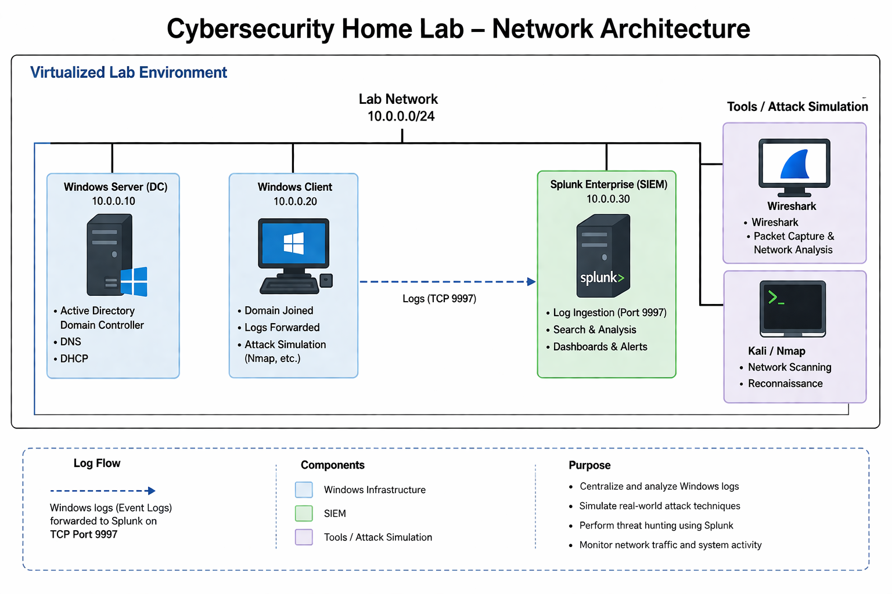

# Cybersecurity Home Lab (Threat Hunting + SIEM)

## Overview
This project documents my cybersecurity home lab where I built a Windows Active Directory environment integrated with Splunk SIEM to simulate real-world security monitoring and threat hunting scenarios.

The goal of this lab was to move beyond basic logging and practice hypothesis-driven threat hunting, detection development, and analysis of endpoint telemetry similar to a SOC environment like SentinelOne.

---

## Lab Environment
- Windows Server VM: Active Directory Domain Controller  
- Windows Client VM: Domain-joined endpoint  
- Splunk Enterprise: SIEM (log ingestion + analysis)  
- Splunk Universal Forwarder: Sends Windows logs to Splunk  
- Tools: Wireshark, Nmap, Windows Event Viewer  

---

## Network Setup
- Logs forwarded to Splunk on port 9997  
- Virtualized lab network for controlled attack simulation  
- Endpoint telemetry collected from Windows machines  

## Network Architecture


---

## What I Configured
- Installed and configured Splunk Enterprise as a SIEM  
- Enabled log ingestion on port 9997  
- Deployed Splunk Universal Forwarder on endpoints  
- Centralized Windows Event Logs into Splunk  
- Built queries to analyze authentication and process activity  

---

## Threat Hunting Approach
Instead of only monitoring logs, I practiced threat hunting using a hypothesis-based approach:

Example hypotheses:
- Multiple failed logins followed by a success may indicate brute force activity  
- Unusual PowerShell execution could indicate living-off-the-land techniques  
- Unexpected network scanning behavior may indicate reconnaissance  

I then used Splunk to test these hypotheses against collected endpoint logs.

---

## Detections & Analysis
- Event ID 4624 (Successful logons)  
- Failed authentication attempts  
- PowerShell activity monitoring  
- Reconnaissance detection using Nmap scans  
- Packet-level inspection with Wireshark  

Example Splunk query:

```spl
index=wineventlog EventCode=4624
```

---

## Detection Queries (Splunk SPL)

These detections were developed using a hypothesis-driven threat hunting approach and align with common attacker techniques from frameworks like MITRE ATT&CK.

### 1. Brute Force Login Detection
Detects multiple failed logins followed by a successful login.

```spl
index=wineventlog (EventCode=4625 OR EventCode=4624)
| stats count by Account_Name, EventCode
| where count > 5
```

**What it shows:**  
Potential brute force attempts where an attacker repeatedly fails before gaining access.

---

### 2. Successful Logons (Baseline Activity)
Tracks normal login activity to establish a baseline.

```spl
index=wineventlog EventCode=4624
| stats count by Account_Name, Workstation_Name
```

**What it shows:**  
Normal authentication patterns so anomalies can be identified.

---

### 3. PowerShell Execution Monitoring
Detects PowerShell usage which may indicate malicious activity.

```spl
index=wineventlog EventCode=4688
| search New_Process_Name="*powershell.exe"
| table _time, Account_Name, New_Process_Name, Command_Line
```

**What it shows:**  
Potential living-off-the-land techniques using PowerShell.

---

### 4. Reconnaissance Detection (Nmap Scan Behavior)
Identifies potential network scanning activity.

```spl
index=wineventlog EventCode=5156
| stats count by Source_Address, Destination_Port
| where count > 50
```

**What it shows:**  
Unusual spikes in connections that may indicate scanning activity.

---

## Use of AI in the Lab
I leveraged AI tools to:
- Generate and refine Splunk queries for threat detection  
- Simulate attacker behaviors and detection scenarios  
- Identify patterns in logs and highlight anomalies  
- Assist in documenting findings and structuring threat hunting workflows  

This reflects how modern security teams use AI to augment analyst capabilities rather than replace them.

---

## Skills Demonstrated
- Threat hunting methodology (hypothesis-driven analysis)  
- SIEM configuration and log ingestion (Splunk)  
- Endpoint telemetry analysis (Windows logs)  
- Detection engineering fundamentals  
- Network and security monitoring  
- Applying AI to improve detection and analysis  

---

## Lessons Learned
This lab helped me understand how endpoint data is collected and analyzed in a SIEM, and how threat hunting differs from basic alert monitoring.

I also learned how important it is to filter noise, build meaningful detection logic, and apply context when investigating activity. Using AI tools showed me how analysts can work more efficiently when generating queries and analyzing patterns in large datasets.

---

## Threat Hunt Case Study: Suspicious Login Activity

### Objective
Investigate potential brute force behavior on a domain-joined Windows machine.

### Hypothesis
Multiple failed login attempts followed by a successful login may indicate unauthorized access.

### Data Source
- Windows Security Logs (Event ID 4625 - failed logon)
- Windows Security Logs (Event ID 4624 - successful logon)

### Method
Used Splunk to correlate failed and successful login events by account:

```spl
index=wineventlog (EventCode=4625 OR EventCode=4624)
| stats count by Account_Name, EventCode
```

### Findings
- Identified multiple failed login attempts on a test account
- Observed a successful login shortly after repeated failures
- Activity originated from the same host

### Conclusion
This pattern is consistent with brute force behavior. In a real environment, this would trigger further investigation or account lockdown.

### Next Steps
- Add alerting for repeated failed logins
- Monitor for lateral movement
- Investigate source system for compromise
